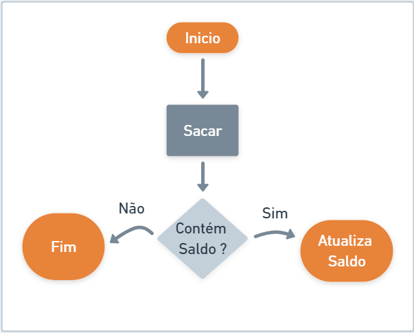
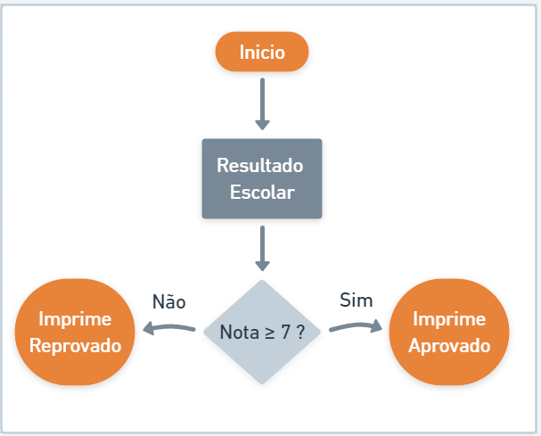
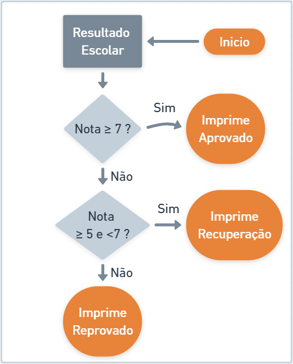

## Conceito

Controle de fluxo é a habilidade de ajustar a maneira como um programa 
realiza suas tarefas. Por meio de instruções especiais, chamadas de comandos, 
essas tarefas podem ser executadas seletivamente, repetidamente ou excepcionalmente.

### Classificação
* **Estruturas condicionais:** if-else, switch-case
* **Estruturas de repetição:** for, while, do-while
* **Estruturas de exceções:** try-catch-finally, throw

#### Estruturas condicionais
A Estrutura Condicional possibilita a escolha de um grupo de ações e comportamentos
a serem executadas quando determinadas condições são ou não satisfeitas.
A Estrutura Condicional pode ser Simples ou Composta.

#### Condicionais Simples
Quando ocorre uma validação de execução de fluxo somente quando a condição for positiva
, consideramos como uma estrutura **Simples**, exemplo:


```java
// CaixaEletronico.java
public class CaixaEletronico {
    public static void main(String[] args) {

       double saldo = 25.0;
       double valorSolicitado = 17.0;

       if(valorSolicitado < saldo)
        saldo = saldo - valorSolicitado;

        System.out.println(saldo);

    }
}
```

#### Condicionais Composta
Algumas vezes o nosso programa deverá seguir mais de uma jornada de execução condionado a 
uma regra de negócio, este cenário é demoninado **Estrutura Condicional Composta**. 
Vejamos o exemplo abaixo:

```java
// CaixaEletronico.java
public class CaixaEletronico {
    public static void main(String[] args) {

       double saldo = 25.0;
       double valorSolicitado = 17.0;

       if(valorSolicitado < saldo)
        saldo = saldo - valorSolicitado;

        System.out.println(saldo);

    }
}
```
<sub>Vale ressaltar aqui que no Java em uma condição**if/else** as vezes necessitamos 
adicionar um bloco de **{ }** se a lógica conter mais de uma linha.

#### Condicionais encadeadas
Em um controle de fluxo condicional, nem sempre nos limitamos ao **se** (if) e 
**senão** (else), poderemos ter uma terceira, quarta e ou inúmeras condições.

```java
// ResultadoEscolar.java
public class ResultadoEscolar {
    public static void main(String[] args) {
        int nota = 6;

	if (nota >= 7)
		System.out.println("Aprovado");
	else if (nota >= 5 && nota < 7)
		System.out.println("Recuperação");
	else
		System.out.println("Reprovado");
    }
}
```

#### Condição ternária
Como vimos em operadores, podemos abreviar nosso algorítmico condicional refatorando 
com o conceito de operador ternário. Vamos refatorar os exemplos acima para ilustrar 
o poder deste recurso:
```java
// Cenário 1
public class ResultadoEscolar {
	public static void main(String[] args) {
		int nota = 7;
		String resultado = nota >=7 ? "Aprovado" : "Reprovado";
		System.out.println(resultado);
	}
}

// Cenário 2
public class ResultadoEscolar {
	public static void main(String[] args) {
		int nota = 6;
		String resultado = nota >=7 ? "Aprovado" : nota >=5 && nota <7 ? "Recuperação" : "Reprovado";
		System.out.println(resultado);
	}
}
```

#### Switch Case
A estrutura **switch** compara o valor de cada caso com o da variável sequencialmente, e 
sempre que encontra um valor correspondente, executa o código associado ao caso. 
Para evitar que as comparações continuem a ser executadas após um caso correspondente ter 
sido encontrado, acrescentamos o comando **break** no final de cada bloco de códigos. 
O comando **break**, quando executado, encerra a execução da estrutura onde ele se encontra.

Vamos imaginar que precisaremos imprimir uma medida com base em mapa de valores, exemplo:
|Sigla|Tamanho|
|-|-|
|P|PEQUENO|
|M|MEDIO|
|G|GRANDE|

```java
// SistemaMedida.java

// Modo condicional if/else
public class SistemaMedida {
	public static void main(String[] args) {
		String sigla = "M";

		if(sigla == "P")
			System.out.println("PEQUENO");
		else if(sigla == "M")
			System.out.println("MEDIO");
		else if(sigla == "G")
			System.out.println("GRANDE");
		else
			System.out.println("INDEFINIDO");
			
		
	}
}

// SistemaMedida.java

// Modo condicional switch / case
public class SistemaMedida {
	public static void main(String[] args) {
		String sigla = "M";

		switch (sigla) {
		case "P":{
			System.out.println("PEQUENO");
			break;
		}
		case "M":{
			System.out.println("MEDIO");
			break;
		}
		case "G":{
			System.out.println("GRANDE");
			break;
		}
		default:
			System.out.println("INDEFINIDO");
		}
			
		
	}
}
```
<sub>Observe que a nível de sintaxe não tivemos nenhum ganho quanto 
a redução de códigos e ainda tivemos mais uma preocupação em informar
a palavra break em cada alternativa.</sub>

Porém um cenário que poderíamos adequar o uso do switch/case para melhorar nosso algorítimo seria conforme ilustração abaixo:

Imagina que fomos requisitados a criar um sistema de plano telefônico onde:
* O sistema terá 03 planos: BASIC, MIDIA , TURBO
* BASIC: 100 minutos de ligação
* MIDIA: 100 minutos de ligação + Whats e Intagram grátis
* TURBO: 100 minutos de ligação + Whats e Intagram grátis + 5Gb Youtube

```java
// Modo condicional convencional
public class PlanoOperadora {
	public static void main(String[] args) {
		String plano = "M"; //M / T
		
		if(plano == "B") {
			System.out.println("100 minutos de ligação");
		}else if(plano == "M") {
			System.out.println("100 minutos de ligação");
			System.out.println("Whats e Intagram grátis");	
		}else if(plano == "T") {
			System.out.println("100 minutos de ligação");
			System.out.println("Whats e Intagram grátis");	
			System.out.println("5Gb Youtube");	
		}
			
		
	}
}

// Modo condicional switch/case
public class PlanoOperadora {
	public static void main(String[] args) {
		String plano = "M"; // M / T

		switch (plano) {
			case "T": {
				System.out.println("5Gb Youtube");
			}
			case "M": {
				System.out.println("Whats e Intagram grátis");
			}
			case "B": {
				System.out.println("100 minutos de ligação");
			}
		}
	}
}
```
<sub>Se optarem por usar switch / case, estudem um pouco mais 
sobre os conceitos de continue, break e default</sub>

#### Estrutura de repetição
Laços de repetição, também conhecidos como laços de iteração ou simplesmente loops,
são comandos que permitem iteração de código, ou seja, que comandos presentes no 
bloco sejam repetidos diversas vezes. (https://diegomariano.com/lacos-de-repeticao-2/)

Laços ou repetições são representados pelas seguintes estruturas:
* **For** (para)
* **While** (enquanto)
* **Do While** (faça enquanto)

#### For
O comando **for** (na tradução literal para a língua portuguesa “para”) permite que uma 
variável contadora seja testada e incrementada a cada iteração, sendo essas informações 
definidas na chamada do comando. O comando for recebe como entrada uma variável contadora,
a condição para continuar a execução e o valor de incrementação.

A estrutura de sintaxe do controle de repetição **for** é exibida abaixo:
```java
//estrutura do controle de fluxo for

for (bloco de inicialização; expressão booleana de validação; bloco de atualização)
{
     // comando que será executado até que a 
     // expressão de validação torne-se falsa 
}
```

Vamos imaginar que Joãozinho precisa contar até 20 carneirinhos para pegar no sono:

```java
// ExemploFor.java
public class ExemploFor {
	public static void main(String[] args) {
		for(int carneirinhos = 1 ; carneirinhos <=20; carneirinhos ++) {
			System.out.println(carneirinhos + " - Carneirinho(s)");
		}
	}
}
```
Vamos explicar a estrutura do código acima:

**For position**
1) int carneirinhos = 1; -> O programa entende que a variável carneirinhos começa 
com o valor igual a 1 e isso acontece somente uma vez;
2) carneirinhos < = 20; -> O programa verifica se a variável carneirinhos ainda
é menor que 20;
3) O programa começa a executar o algorítimo, no nosso caso imprimir a quantidade
de carneirinhos em contagem;
4) carneirinhos ++ -> O programa aumenta em mais 1 o valor da variável carneirinhos;
5) O fluxo é finalizado quando a variável carneirinhos for igual a 20.

```java
// Outras estruturas

//estrutura 1
for(int carneirinhos = 1 ; carneirinhos <=20; carneirinhos ++) {
     System.out.println(carneirinhos + " - Carneirinho(s)");
}

//estrutura 2
//o que importa é somente o bloco condicional
int carneirinhos = 1;
for( ; carneirinhos <=20; ) {
     System.out.println(carneirinhos + " - Carneirinho(s)");
     carneirinhos ++;
}

//for( somente 1x ; deve ser uma expresão boolean; acontecerá a cada final da execução ) { }
```

Também usamos o controle de fluxo for para interagir sobre arrays e coleções:

```java
// ExemploFor.java
public class ExemploFor {
	public static void main(String[] args) {
		String alunos[] = { "FELIPE", "JONAS", "JULIA", "MARCOS" };

		for (int x=0; x<alunos.length; x++) {
			System.out.println("O aluno no indice x=" + x + " é " + alunos[x]);
		}
	}
}
```

Observe que como os arrays começam com índice igual a 0 (zero), iniciamos a nossa 
variável x também com valor zero e validamos a quantidade de repetições a partir 
da quantidade de elementos do array.

#### For Each
O uso do **for / each** está fortemente relacionado com um cenário onde 
contenha um array ou coleção, e assim, a interação é baseada aos 
elementos da coleção.

```java
// ExemploFor.java
public class ExemploFor {
	public static void main(String[] args) {
		String alunos [] =  {"FELIPE","JONAS","JULIA","MARCOS"};
		
			//Forma abreviada
		for(String aluno : alunos) {
		System.out.println(alunos);
		}

	}
}
```
1) String aluno : alunos -> De forma abreviada é criada uma variável nome obtendo
 um elemento do vetor a cada ocorrência.
2) A impressão de cada aluno é realizada.

#### break e continue
**Break** significa quebrar, parar, frear, interromper. E é isso que se faz
quando o Java encontra esse comando pela frente. Continue, como o nome diz, 
ele 'continua' o laço. O comando break interrompe o laço, já o continue 
interrompe somente a iteração atual.
```java
// class ExemploBreakContinue.java
public class ExemploBreakContinue {
	public static void main(String[] args) {
	
	for(int numero = 1; numero <=5; numero ++){
		if(numero==3)
			break;
		
		System.out.println(numero);
		
	}
	//Qual a saída no console ?

    }
}
```

```java
// class ExemploBreakContinue.java
public class ExemploBreakContinue {
	public static void main(String[] args) {
	
	for(int numero = 1; numero <=5; numero ++){
		if(numero==3)
			continue;
		
		System.out.println(numero);
		
	}
	//Qual a saída no console ?

    }
}
```
<sub>Observem que sempre o break e continue está condicinado a um critério de negócio.</sub>

#### While
O laço **while** (na tradução literal para a língua portuguesa “enquanto”) determina
que enquanto uma condição for válida, o bloco de código será executado. O laço
**while** testa a condição antes de executar o código, logo, caso a condição seja
inválida no primeiro teste o bloco nem será executado.

A estrutura de sintaxe do controle de repetição **while** é exibida abaixo:
```java
//estrutura do controle de fluxo while

while (expressão booleana de validação)
{
     // comando que será executado até que a 
     // expressão de validação torne-se falsa 
}
```
Joãozinho recebeu R$ 50,00 de mesada e foi em uma loja de doces gastar todo o
seu dinheiro, logo, enquanto o valor dos doces não igualar a R$ 50,00 ele foi
adicionando itens no carrinho.
```java
// ExemploWhile.java
import java.util.concurrent.ThreadLocalRandom;
public class ExemploWhile {
public static void main(String[] args) {
	double mesada = 50.0;
        while(mesada>0) {
            Double valorDoce = valorAleatorio();
            if(valorDoce > mesada)
                valorDoce = mesada;

            System.out.println("Doce do valor: " + valorDoce + " Adicionado no carrinho");
            mesada = mesada - valorDoce;
        }
        System.out.println("Mesada:" + mesada);
        System.out.println("Joãozinho gastou toda a sua mesada em doces");
        
        /*
        * Não se preocupe quanto a formatação de valores
        * Iremos explorar os recursos de formatação em breve !!
        */
   }
   private static double valorAleatorio() {
	return ThreadLocalRandom.current().nextDouble(2, 8);
   }
}
```

#### Do While
O laço **do / while** (na tradução literal para a língua portuguesa “faça…enquanto”), 
assim como o laço while, considera que enquanto uma determinada condição for válida
o bloco de código será executado. Entretanto, **do / while** testa a condição após executar
o código,sendo assim, mesmo que a condição seja considerada inválida no primeiro teste
o bloco será executado pelo menos uma vez.

A estrutura de sintaxe do controle de repetição **do / while** é exibida abaixo:
```java
//estrutura do controle de fluxo do while

do
{
    // comando que será executado até que a 
     // expressão de validação torne-se falsa 
}
while (expressão booleana de validação);
```
Joãozinho resolveu ligar para o seu amigo dizendo que hoje se entupiu de comer docinhos:
```java
// ExemploDoWhile.java

import java.util.Random;
public class ExemploDovWhile {
public static void main(String[] args) {
	public static void main(String[] args) {
		System.out.println("Discando...");
		
		do {
			//excutando repetidas vezes até alguém atender
			System.out.println("Telefone tocando");
		
		}while(tocando());
		
		System.out.println("Alô !!!");
	}
	private static boolean tocando() {
		boolean atendeu = new Random().nextInt(3)==1;
		System.out.println("Atendeu? " + atendeu);
		//negando o ato de continuar tocando
		return ! atendeu;
	}
}
```
#### Estruturas condicionais

##### Exceções
Ao executar o código Java, diferentes erros podem acontecer: 
erros de codificação feitos pelo programador, erros devido a 
entrada errada ou outros imprevistos.

Quando ocorre um erro, o Java normalmente para e gera uma 
mensagem de erro. O termo técnico para isso é: Java lançará 
uma exceção (jogará um erro).

De forma interpretativa em Java, um erro é algo irreparável, 
a aplicação trava ou é encerrada drasticamente. Já exceções 
é um fluxo inesperado da nossa aplicação, exemplo: Querer 
dividir um valor por zero, querer abrir um arquivo que não 
existe, abrir uma conexão de banco com usuário ou senha inválida. 
Todos estes cenários e os demais não são erros mas sim fluxos 
não previstos pela aplicação.

É ai que entra mais uma responsabilidade do desenvolvedor, 
prever situações iguais a estas e realizar o que denominamos 
de Tratamento de Exceções.

##### Mão na massa
Vamos trazer o cenário que estudamos na aula sobre Terminal 
e Argumentos onde via terminal informamos alguns dados pessoais.
```java
import java.util.Locale;
import java.util.Scanner;

public class AboutMe {
    public static void main(String[] args) {
        //criando o objeto scanner
        Scanner scanner = new Scanner(System.in).useLocale(Locale.US);
        
        System.out.println("Digite seu nome");
        String nome = scanner.next();
        
        System.out.println("Digite seu sobrenome");
        String sobrenome = scanner.next();

        System.out.println("Digite sua idade");
        int idade = scanner.nextInt();
        
        System.out.println("Digite sua altura");
        double altura = scanner.nextDouble();

        
        //imprimindo os dados obtidos pelo usuario
        System.out.println("Ola, me chamo " + nome.toUpperCase() + " " + sobrenome.toUpperCase());
        System.out.println("Tenho " + idade + " anos ");
        System.out.println("Minha altura é " + altura + "cm ");
        scanner.close();   
    }
```

Aparentemente é um programa simples, mas vamos listar algumas possíveis 
exceções que podem acontecer.
1) Não informar o nome e sobrenome
2) O valor da idade ter um caractere NÃO numérico
3) O valor da altura ter uma vírgula ao invés de ser um ponto (conforme padrão americano)

Executando o nosso programa com os valores abaixo, vamos entender qual exceção acontecerá:
|Entrada|Valor|Exceção|Causa|
|-|-|-|-|
|Digite seu nome:|**Marcelo**|||
|Digite seu sobrenome:|**Azevedo**|||
|Digite sua idade:|**quinze (15)**|java.util.InputMismatchException|O programa esperava o valor do tipo numérico inteiro.|
|Digite sua altura:|**1,65**|java.util.InputMismatchException|O programa esperava o valor do tipo numérico decimal no formata americano, exemplo: **1.65**|

<sub>A melhor forma de prever que pode ocorrer uma exceção, é pensar que ela pode ocorrer.
Lei de Murphy</sub>

##### Conhecendo algumas exceções já mapeadas
A linguagem Java dispõe de uma vasta lista de classes que representam exceções, 
abaixo iremos apresentar as mais comuns:
|Nome|Causa|
|-|-|
|java.lang.NullPointerException|Quando tentamos obter alguma informação de uma variável nula.|
|java.lang.ArithmeticException|
Quando tentamos obter alguma informação de uma variável nula.|
|java.sql.SQLException|Quando existe algum erro relacionado a interação com banco de dados.|
|java.io.FileNotFoundException|Quando tentamos ler ou escrever em um arquivo que não existe.|

##### Tratamento de exceções
E quando inevitavelmente ocorrer uma exceção? Como nós desenvolvedores podemos
ajustar o nosso algoritmo para amenizar o ocorrido?

A instrução **try** permite que você defina um bloco de código para ser testado
quanto a erros enquanto está sendo executado.

A instrução **catch** permite definir um bloco de código a ser executado, 
caso ocorra um erro no bloco try.

A instrução **finally** permite definir um bloco de código a ser executado
independente de ocorrer um erro ou não. As palavras-chave try e catch vêm em pares:

Estrutura de um bloco com try e catch
```java
try {
  //  bloco de código conforme esperado
}
catch(Exception e) {// precisamos saber qual exceção
  // bloco de código que captura as exceções que podem acontecer
  // em caso de um fluxo não previsto
}
```
<sub>O bloco try / catch pode conter um conjunto de catchs correspondentes a 
cada exceção que prevista em uma funcionalidade do programa.</sub>

##### Hierarquia das exceções
A linguagem Java dispõe de uma variedade de classes que representam exceções,
e estas classes são organizadas em uma hierarquia denominadas Checked and Unchecked
Exceptions ou Exceções Checadas e Não Checadas.


<sub>O que determina uma exceção ser classificado como checada ou não checada ?
É o risco dela ser disparada logo você precisa tratá-la, exemplo:</sub>

Vamos imaginar que precisamos realizar de duas maneiras a conversão de
uma String para um número, porém o texto contém Alfanuméricos.
```java
public class ExemploExcecao {
    public static void main(String[] args) {
        Number valor = Double.valueOf("a1.75");

        valor = NumberFormat.getInstance().parse("a1.75");
        
        System.out.println(valor);
       
    }
}
```
<sub>As linhas 3 e 5 apresentarão uma exceção ao serem executadas, e a linha 5 
contém um método que pode disparar uma exceção checada, logo nós programadores
que iremos usar este método teremos que tratá-la explicitamente com try \ catch.</sub>

##### Exceções customizadas
Nós podemos criar nossas próprias exceções baseadas em regras de negócio e assim
melhor direcionar quem for utilizar os recursos desenvolvidos no projeto, exemplo:
* Imagina que como regra de negócio, para formatar um cep necessita sempre de ter
8 dígitos, caso contrário lançará uma exceção que denominamos de **CepInvalidoException**.
* Primeiro criamos nossa exceção:
```java
public class CepInvalidoException extends Exception {}
```
* Em seguida criamos nosso método de formatação de cep.
```java
static String formatarCep(String cep) throws CepInvalidoException{
        if(cep.length() != 8)
          throw new CepInvalidoException();
        
          //simulando um cep formatado
          return "23.765-064";
    }
```