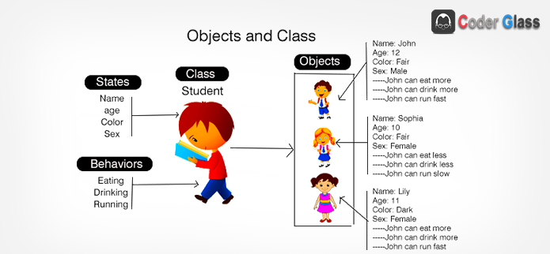
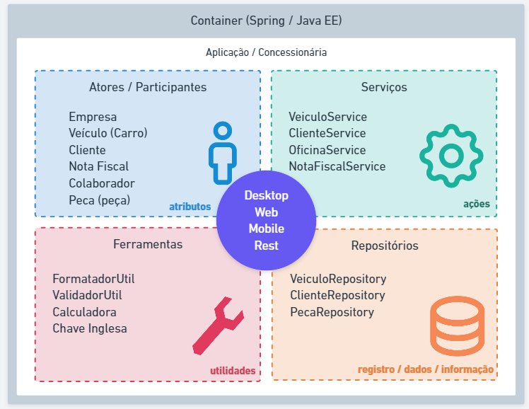
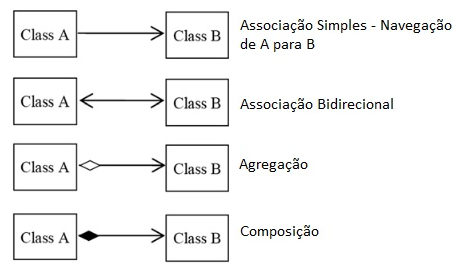
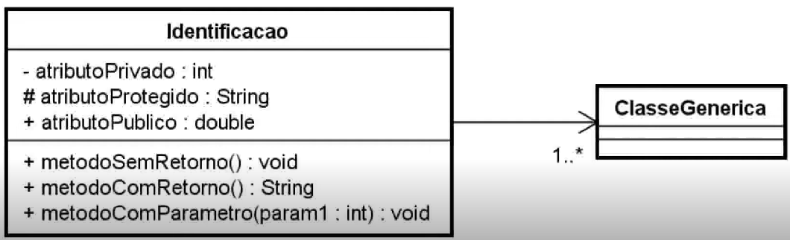

# Conceito de POO
Programação orientada a objetos (POO, ou OOP segundo as suas siglas em inglês) é um paradigma 
de programação baseado no conceito de "objetos", que podem conter dados na forma de campos,
também conhecidos como atributos, e códigos, na forma de procedimentos, também conhecidos 
como métodos.

Como se trata de um contexto análogo ao mundo real, tudo no qual nos referimos são objetos,
exemplo: Conta bancária, Aluno, Veículo, Transferência etc.

A programação orientada a objetos é bem requisitada no contexto das aplicações mais atuais
no mercado devido a possibilidade de reutilização de código e a capacidade de representação
do sistema ser muito mais próximo do mundo real.

Para uma linguagem ser considerada orientada a objetos, esta deve seguir o que denominamos
como **Os quatro pilares da orientação a objetos**:
* **Encapsulamento:** Nem tudo precisa estar visível, grande parte do nosso algoritmo pode
ser distribuído em métodos com finalidades específicas que complementa uma ação em nossa aplicação.
Exemplo: Ligar um veículo exige muitas etapas para a engenharia, mas o condutor só visualiza
a ignição, dar a partida e a “magia” acontece.
* **Herança:** Características e comportamentos comuns podem ser elevados e compartilhados através
de uma hierarquia de objetos.
Exemplo: Um Carro e uma Motocicleta possuem propriedades como placa, chassi, ano de fabricação e 
métodos como acelerar, frear. Logo para não ser um processo de codificação redundante, podemos 
desfrutar da herança criando uma classe Veiculo para que seja herdada por Carro e Motocicleta.
* **Abstração:** É a indisponibilidade para determinar a lógica de um ou vários comportamentos
em um objeto.
Exemplo: Veículo determina duas ações como acelerar e frear, logo estes comportamentos deverão
ser abstratos pois existem mais de uma maneira de se realizar a mesma operação. ver Polimorfismo.
* **Polimorfismo:** São as inúmeras maneiras de se realizar uma mesma ação.
Exemplo: Veículo determina duas ações como acelerar e frear, primeiramente precisamos identificar
se estaremos nos referindo a **Carro** ou **Motocicleta** para determinar a lógica de aceleração
e frenagem dos respectivos veículos.

## Classes
Toda a estrutura de código na linguagem Java é distribuído em arquivos com extensão 
.java denominados de classe.

As classes existentes em nosso projeto serão composta por:

**Identificador**, **Características** e **Comportamentos**.

* **Classe** (class): A estrutura e ou representação que direciona a criação dos objetos
de mesmo tipo.
* **Identificador** (identity): Propósito existencial aos objetos que serão criados.
* **Características** (states): Também conhecido como atributos ou propriedades, é
toda informação que representa o estado do objeto.
* **Comportamentos** (behavior): Também conhecido como ações ou métodos, é toda parte
comportamental que um objeto dispõe.
* **Instanciar** (new): É o ato de criar um objeto a partir de estrutura definida em uma classe.

<sub>Ilustração de uma classe Estudante e 03 objetos criados</sub>

Para ilustrar as etapas de desenvolvimento orientada a objetos em Java, iremos reproduzir a 
imagem acima em forma de código para explicar que primeiro criamos a estrutura correspondente
para assim podermos cria-los com as características e possibilidade de realização de ações
(comportamentos) como se fosse no "mundo real".
```java
// Criando a classe Student
// Com todas as características e compartamentos aplicados

public class Student {
    String name;
    int age;
    Color color;
    Sex sex;

    void eating(Food food){
      //NOSSO CÓDIGO AQUI
    }
    void drinking(Eat eat){
      //NOSSO CÓDIGO AQUI
    }
    void running(){
      //NOSSO CÓDIGO AQUI
    }
}
```
```java
// Criando objetos a partir da classe Student

public class School {
    public static void main(String[] args) throws Exception {
      Student student1 = new Student();
      student1.name= "John";
      student1.age= 12;
      student1.color= Color.FAIR;
      student1.sex= Sex.MALE;

      Student student2 = new Student();
      student2.name= "Sophia";
      student2.age= 10;
      student2.color= Color.FAIR;
      student2.sex= Sex.FEMALE;

      Student student3 = new Student();
      student3.name= "Lily";
      student3.age= 11;
      student3.color= Color.DARK;
      student3.sex= Sex.FEMALE;
    }
}
```
<sub>No exemplo acima, NÃO estruturamos a classe Student com o padrão 
Java Beans getters e setters.</sub>

Seguindo algumas convenções, as nossas classes são classificadas como:
* **Classe de modelo (model):** classes que representem estrutura de 
domínio da aplicação, exemplo: Cliente, Pedido, Nota Fiscal e etc.
* **Classe de serviço (service):** classes que contém regras de negócio
e validação de nosso sistema.
* **Classe de repositório (repository):** classes que contém uma integração
com banco de dados.
* **Classe de controle (controller):** classes que possuem a finalidade de 
disponibilizar alguma comunicação externa à nossa aplicação, tipo http web ou webservices.
* **Classe utilitária (util):** classe que contém recursos comuns à toda nossa aplicação.

<sub>Modelo aplicado em grande parte dos projetos atuais</sub>
<sub>Exercite a distribuição de classes por papéis dentro da sua aplicação para que se 
possa determinar a estrutura mais conveniente em cada arquivo do seu projeto.</sub>

## Pacotes
A linguagem Java é composta por milhares de classes com as finalidades de, por exemplo:
Classes de tipos de dados, representação de texto, números, datas, arquivos e diretórios,
conexão a banco de dados, entre outras. Imagina todas estas classes existirem em um único
nível de documentos? E as classes desenvolvidas por nós, meros desenvolvedores de aplicações
de vários os gêneros? Imagina como ficaria este diretório em? 
Para prevenir este acontecimento, a linguagem dispões de um recurso que organiza as classes
padrão e criadas por nós, que conhecemos como pacote (package). Os pacotes são subdiretórios
a partir da pasta src do nosso projeto onde estão localizadas as classes da linguagem e novas
que forem criadas para o projeto. Existem algumas convenções para criação de pacotes já
utilizados no mercado. 

### Nomeclatura
Vamos imaginar que sua empresa se chama **Power Soft** e ela está desenvolvendo softwares
comercial, governamental e um software livre ou de código aberto. Abaixo os pacotes sugeridos
conforme tabela abaixo:
* Comercial: com.powersoft
* Governamental: gov.powersoft
* Código abertoL: org.powersoft

Bem, acima já podemos perceber que existe uma definição para o uso do nome dos pacotes, porém
podemos organizar ainda mais um pouco as nossas classes mediante a proposta de sua existência:
* **model:** Classes que representam a camada e modelo de aplicação: Cliente, Pedido, Nota Fiscal,
Usuário.
* **repository:** Classes ou interfaces que possuem a finalidade de interagir com tabelas no banco
de dados: ClienteRepository.
* **service:** Classes que contém regras de negócio do sistema: ClienteService possui o método
validar o CPF do cliente cadastrado.
* **controller:** Classes que possuem a finalidade de disponibilizar os nossos recursos da aplicação
para outras aplicações via padrão HTTP.
* **view:** Classe que possuem alguma interação com a interface gráfica acessada pelo usuário.
* **util:** Pacote que contém classes utilitárias do sistema: FormatadorNumeroUtil, ValidadorUtil.

### Identificação
Uma das características de uma classe é a sua identificação, Cliente, NotaFiscal, TituloPagar, porém
quando esta classe é organizada por pacotes, ele passa a ter duas identificações. O nome simples 
(**próprio nome**) e agora o nome qualificado (**endereçamento do pacote + nome**). exemplo: Considere
a classe Usuario que está endereçada no pacote com.controle.acesso.model, o nome qualicado desta classe
é **com.controle.acesso.model.Usuario**

### Package versus Import

A localização de uma classe é definida pela palavre reservada package, logo, uma classe só contém
uma definição de package no arquivo, sempre na primeira linha do código. Para a utilização de uma
classe existente em outros pacotes, necessitamos realizar a importação das mesmas, seguindo a
recomendação abaixo:

```java
package

import ...
import ...

public class MinhaClasse {

}
```
### Por que é tão importante compreender pacotes?
A linguagem Java é composta por milhares de classes internas, classes desenvolvidas em projetos
disponívei através de bibliotecas e as classes do nosso projeto. Logo, existe uma enorme possibilidade
da existência de classes de mesmo nome.

É nessa hora, que nós desenvolvedores precsamos detectar qual classe iremos importa para o nosso
projeto.

Um exemplo clássico é a existência das classe **java.sql.Date** e **java.util.Date** da própria
linguagem, recomendo você leitor pesquisar sobre a diferença das duas classes.

## Visibilidade dos recursos
### Modificadores
Em Java, utilizamos três palavras reservadas e um conceito default (sem nenhuma palavra reservada)
para definir os quatro tipo de visibilidade de atributos, métodos e até mesmo classes no que se
refere ao acesso por outras classes. Iremos ilustrar do mais visível ao mais restrito tipo de 
visibilidade nos arquivos em nosso projeto.

Para uma melhor ilustração iremos representar os conceitos de visibilidade de recursos através
do contexto em uma lanchonete que vende lanche natural e suco.

#### Modificador public
Como o próprio nome representa, quando nossa classe, método e atributo é definido como public,
qualquer outra classe em qualquer outro pacote pode visualizar tais recursos.
Ex.: Na nossa lanchonete tudo é visível e todos que integram o espaço se visualizam.

### Modificador privado
Depois de reestruturar nosso estabelecimento (projeto), onde, temos as divisões (pacotes)
espaço do cliente e atendimento, chegou a hora de uma reflexão sobre visibilidade ou modificadores
de acesso.

Conhecemos as ações disponíveis nas classes Cozinheiro, almoxarife, Atendente e Cliente,
mesmo com a organização da visibilidade por pacote, será que realmente estas classes precisam ser
tão explicitas?
* Será que o Cozinheiro precisa saber que/como o Almoxarife controla as entradas e saídas?
* Que o Cliente precisa saber como o Atendente recebe o pedido para servir sua mesa?
* Que o Atendente precisa saber que antes de pagar, o Cliente consulta o saldo no App?

Diante destes questionamentos é que nossas classes precisam continuar mantendo suas
ações (métodos) mas nem todas precisam ser vistas por ninguém
<sub>A visibilidade de recursos da linguagem não está associada a **interface gráfica**, mas sim,
 o que as classes conseguem **acessar** umas das outras</sub>

 ## Getters e Setters
 Seguindo a convensão Java Beans

Os métodos "Getters" e "Setters" são utilizados para buscar valores de atributos ou definir 
novos valores de atributos de instâncias de classes.

O método **Getter** retorna o valor do atributo especificado.

O método **Setter** define outro novo valor para o atributo especificado.

Vemos o código abaixo da criação de um objeto Aluno com nome e idade:
```java
/arquivo Aluno.java
public class Aluno {
	String nome;
	int idade;
}

//arquivo Escola.java
public class Escola {
	public static void main(String[] args) {
		Aluno felipe = new Aluno();
		felipe.nome="Felipe";
		felipe.idade = 8;
		
		System.out.println("O aluno " + felipe.nome + " tem " + felipe.idade + " anos ");
		//RESULTADO NO CONSOLE
		//O aluno Felipe tem 8 anos 		
	}
}
```
Seguindo a convenção Java Beans, uma classe que contém esta estrutura de estados deverá 
seguir as regras abaixo:
* Os atributos precisam ter o modificador de acesso private. Ex.: private String nome;
* Como agora os atributos estarão somente a nível de classe, precisaremos dos métodos 
getX e setX, Ex.: getNome() e setNome(String novoNome);
* O método get é responsável por obter o valor atual do atributo, logo ele precisa ser
public retornar um tipo correspondente ao valor, Ex.: public String getNome() {};
* O método set é responsável por definir ou modificador o valor de um atributo em um objeto,
 logo ele também precisa ser public, receber um parâmetro do mesmo tipo da variável mas não 
 retorna nenhum valor void. Ex.: public void setNome(String newNome);
 ```java
 //arquivo Aluno.java
public class Aluno {
	private String nome;
	private int idade;
	
	public String getNome() {
		return nome;
	}
	public void setNome(String newNome) {
		nome = newNome;
	}
	public int getIdade() {
		return idade;
	}
	public void setIdade(int newIdade) {
		this.idade = newIdade;
	}
}
//arquivo Escola.java
public class Escola {
	public static void main(String[] args) {
		Aluno felipe = new Aluno();
		felipe.setNome("Felipe");
		felipe.setIdade(8);
		
		System.out.println("O aluno " + felipe.getNome() + " tem " + felipe.getIdade() + " anos ");	
	}
}
 ```
<sub>A proposta do código acima é a mesma que o código anterior, a diferença é que adotamos a 
convenção Java Beans para definir e obter as características dos nossos objetos.</sub>

Uso do this no método set. É muito comum vermos nossos métodos de definição ter a seguinte sintaxe:
```java
//arquivo Aluno.java
private String nome;

public void setNome(String nome) {
	this.nome = nome;
}
```
<sub>Observe que a descrição do nosso atributo nome é igual a descrição do parâmetro, 
logo utilizamos mais uma palavra reservada this para distinguir um do outro. Para mais 
detalhes veja Palavras Reservadas<sub/>

## Construtores
Sabemos que para criar um objeto na linguagem Java utilizamos a seguinte estrutura de código:
```java
Classe novoObjeto = new Classe();
```

Desta forma será criado um novo objeto na memória, este recurso também é conhecido como 
instanciar um novo objeto.

Muitas das vezes já queremos que na criação (instanciação) de um objeto, a linguagem já solicite 
para quem for criar este novo objeto defina algumas propriedades essenciais. Abaixo iremos 
ilustrar uma classe Pessoa onde a mesma terá os atributos: Nome, CPF, Endereço.
```java
public class Pessoa {
	private String nome;
	private String cpf;
	private String endereco;
	
	public String getNome() {
		return nome;
	}
	public String getCpf() {
		return cpf;
	}
	public String getEndereco() {
		return endereco;
	}
	public void setEndereco(String endereco) {
		this.endereco = endereco;
	}
	//...
	//setters de nome e cpf ?
}
```
Criaremos uma Pessoa mas como não temos o setter para nome e cpf, este objeto não tem como
receber estes valores.
```java
public class SistemaCadastro {
	public static void main(String[] args) {
		//criamos uma pessoa no sistema
		Pessoa marcos = new Pessoa();
		
		//definimos o endereço de marcos
		marcos.setEndereco("RUA DAS MARIAS");
		
		//e como definir o nome e cpf do marcos ?
		
		//imprimindo o marcos sem o nome e cpf
		
		System.out.println(marcos.getNome() + "-" + marcos.getCpf());
	}
}
```
Entrando em cena o construtor para criar nossos objetos já com valores requeridos na 
momento da criação\instanciação (new).
```java
public class Pessoa {
	private String nome;
	private String cpf;
	private String endereco;
	
	// método construtor
	// o nome deverá ser igual ao nome da classe
	public Pessoa (String cpf, String nome) {
		this.cpf = cpf;
		this.nome = nome;
	}
	
	//...
	//getters
	//setters
}
```
Alterando o nosso sistema para agora criar o objeto com informações já requeridas 
conforme definição da ordem dos parâmetros do construtor.
```java
public class SistemaCadastro {
	public static void main(String[] args) {
		//criamos uma pessoa no sistema
		Pessoa marcos = new Pessoa("06724506716","MARCOS SILVA");
		
		//continua ...
		
	}
}
```

## Enums
Enum é um tipo especial de classe onde os objetos são previamente criados, imutáveis 
e disponíveis por toda aplicação.

Usamos Enum quando o nosso modelo de negócio contém objetos de mesmo contexto que 
já existem de pré-estabelecida com a certeza de não haver tanta alteração de valores.

Exemplos:
* Grau de Escolaridade: Analfabeto, Fundamental, Médio, Superior
* Estado Civil: Solteiro, Casado, Divorciado, Viúvo
* Estados Brasileiros: São Paulo, Rio de Janeiro, Piauí, Maranhão.
<sub>Não confunda uma lista de constantes com enum.</sub>

Enquanto que uma constante é uma variável de tipo com valor imutável, um enum 
é um conjunto de objetos já pre-definidos na aplicação.

Como um enum é um conjunto de objetos, logo, estes objetos podem conter 
atributos e métodos. Veja o exemplo de um enum para disponibilizar os 
quatro estados brasileiros citados acima, contendo informações de: Nome, 
Sigla e um método que pega o nome do de cada estado e já retorna para tudo maiúsculo.
```java
// Criando o enum EstadoBrasileiro para ser usado em toda a aplicação.
public enum EstadoBrasileiro {
	SAO_PAULO ("SP","São Paulo"),
	RIO_JANEIRO ("RJ", "Rio de Janeiro"),
	PIAUI ("PI", "Piauí"),
	MARANHAO ("MA","Maranhão") ;
	
	private String nome;
	private String sigla;
	
	private EstadoBrasileiro(String sigla, String nome) {
		this.sigla = sigla;
		this.nome = nome;
	}
	public String getSigla() {
		return sigla;
	}
	public String getNome() {
		return nome;
	}
	public String getNomeMaiusculo() {
		return nome.toUpperCase();
	}
	
}
```

Boas práticas para criar objetos Enum
* As opções (objetos) devem ser descritos em caixa alta separados por underline (_),
ex.: OPCAO_UM, OPCAO_DOIS
* Após as opções deve-se encerrar com ponto e vírgula (;)
* Um enum é como uma classe, logo poderá ter atributos e métodos tranquilamente
* Os valores dos atributos devem já ser definidos após cada opção dentro de parênteses 
como se fosse um new
* O construtor deve ser privado
* Não é comum um enum possuir o recurso setter (alteração de propriedade), somente os 
métodos getters correspondentes.

Agora **NÃO** precisaremos criar objetos que representam cada estado toda vez que precisarmos 
destas informações, basta usar o **enum** acima e escolher a opção (objeto) já pré-definido 
em qualquer parte do nosso sistema.
```java
// qualquer classe do sistema poderá obter os objetos de EstadoBrasileiro
public class SistemaIbge {
	public static void main(String[] args) {
		//imprimindo os estados existentes no enum
		for(EstadoBrasileiro uf: EstadoBrasileiro.values() ) {
		   System.out.println(uf.getSigla() + "-" + uf.getNomeMaiusculo());
		}
		
		//selecionando um estado a partir das opções disponíveis
		EstadoBrasileiro ufSelecionado = EstadoBrasileiro.PIAUI;
		
		System.out.println("O estado selecionado foi: " + ufSelecionado.getNome());
	}
}
```

## UML
Linguagem de Modelagem Unificada ou UML é uma notação que possibilita a representação
gráfica do projeto.

Na UML temos três conceitos necessários para compreendermos inicialmente:
**diagramas, elementos e relacionamentos**.

As notações UML são distribuídas em duas categorias de diagramas, a estrutural
e comportamental conforme listagem abaixo:

### Diagramas estruturais
* **Diagrama de classe**: O Diagrama de Classes é utilizado para fazer a representação
de estruturas de classes de negócio, interfaces e outros componentes do sistema. 
Por esta característica, este diagrama é considerado o mais importante para a UML,
pois auxilia a maioria dos demais diagramas.
* **Diagramas de objetos**: Este diagrama representa os objetos existentes em um
determinado instante ou fato na aplicação. Assim conseguimos ter uma perspectiva do
estado de nossos objetos mediante a interação dos usuários no sistema.
<sup>Existem outras categorias de diagramas estruturais e comportamentais, porém
iremos focar nos citados acima.</sup>

### Diagrama de classe
O diagrama de classes ilustra **graficamente** como classes estão estruturadas e
interligadas entre si diante da proposta do nosso software.

Em diagrama a estrutura das classes é constituída por:

**Identificação**: Nome e/ou finalidade da classe

**Atributos**: Propriedades e/ou características

**Operações**: Ações e/ou métodos

#### Relacionamentos
Em um diagrama as classes podem existir de forma independente, mas obviamente haverá
em alguma etapa da aplicação e necessidade de algumas se relacionarem, o que devemos
compreender é o nível de dependência entre elas:
* Associação -> Uma associação define um relacionamento entre duas classes, permitindo
que um objeto tenha acesso a estrutura de um outro objeto. 

* **Agregação**: Em uma agregação a classe principal contém ma relação com outra classe
mas ela pode existir sem a classe agregadora. Imagina em um cadastro de Candidatos, podemos
encontrar candidatos que ainda não possuam uma Profissão.

<sub>Candidato é classe principal e a Profissão agregação</sub>
* **Composição**: A composição já caracteriza uma dependência existente entre a classe
principal e a classe associada. Imaginamos que uma Admissão só poderá existir contendo
suas informações básicas e a composição do Candidato selecionado.

<sub>Admissao é a classe principal e Candidato compõe a Admissao</sub>

### Multiplicidade
Nem sempre o relacionamento entre as classes será de **um para um**, um determinado
cenário poderá exigir multiplicidade específicas conforme opções abaixo:
* 1. -> Representa uma associação **contendo um elemento**.
* *. -> Representa uma associação **contendo uma lista de elementos**.
* 0..1 -> Representa uma associação **contendo zero ou um elemento**.
* 0..* -> Representa uma associação **contendo zero ou uma lista de elementos**.
* 1..* -> Representa uma associação **contendo um ou uma lista de elementos**.

### Visibilidade
Os atributos e métodos de uma classe podem receber níveis de visibilidade, e na UML
existem símbolos que representam cada um deles.
* (+) Visibilidade pública
* (#) Visibilidade protegida (muito associada com herança)
* (-) Visibilidade privada


<sub>Ilustração utilizando a ferramenta Astah Community</sub>

Casos de estudo

